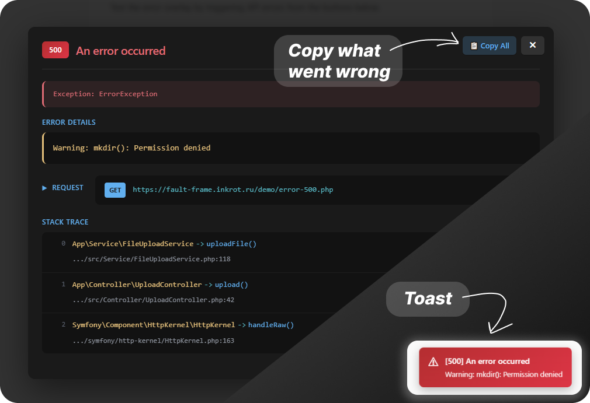

# FaultFrame

<div align="center">


Frontend library that automatically catches and displays errors from backend frameworks (Symfony, Laravel, Express) in a beautiful overlay with stack traces and request details.

[](https://www.npmjs.com/package/fault-frame)
[](https://opensource.org/licenses/MIT)

</div>

## Features

- Automatic error interception (Axios, Fetch)
- Stack traces with file paths and line numbers
- Request/response details
- Toast notifications
- Works with React, Vue, vanilla JS
- Backend framework-specific parsers (Symfony, Laravel, Express)

## Demo

**[Try Live Demo →](https://fault-frame.inkrot.ru/demo)**

<div align="center">



</div>

## Installation

```bash
npm install fault-frame
# or
yarn add fault-frame
```

> **Note:** If using with axios, you need to install it separately.

## Quick Start

### Axios (Automatic)

```typescript
import axios from 'axios';
import { FaultFrame } from 'fault-frame';

// Initialize FaultFrame with your backend framework
FaultFrame.init({
  framework: 'symfony',  // or 'laravel', 'express'
  axiosInstance: axios,
  enabled: true,
});

// Now all Axios errors are automatically caught and displayed!
```

### Fetch API (Wrapper)

```typescript
import { FaultFrame, createFetchWithFaultFrame } from 'fault-frame';

// Initialize FaultFrame
FaultFrame.init({
  framework: 'symfony',
  enabled: true,
});

// Create fetch wrapper
const fetchWithErrors = createFetchWithFaultFrame(FaultFrame.getInstance());

// Use like normal fetch - errors are automatically caught!
async function loadUsers() {
  const response = await fetchWithErrors('/api/users');
  const data = await response.json();
  return data;
}
```

## Configuration

### Basic Configuration

```typescript
FaultFrame.init({
  framework: 'symfony',        // Backend framework
  axiosInstance: axios,        // Axios instance (optional)
  enabled: true,               // Enable/disable (default: true)
  showToast: true,             // Show toast notifications (default: true)
  toastPosition: 'bottom-right', // Toast position (default: 'bottom-right')
  toastDuration: 5000,         // Toast duration in ms (default: 5000)
});
```

### Configuration Options

| Option | Type | Default | Description |
|--------|------|---------|-------------|
| `framework` | `'symfony' \| 'laravel' \| 'express'` | **Required** | Backend framework type |
| `axiosInstance` | `AxiosInstance` | - | Axios instance for auto-interceptor |
| `enabled` | `boolean` | `true` | Enable/disable error catching |
| `showToast` | `boolean` | `true` | Show toast notifications |
| `autoInstallAxios` | `boolean` | `true` | Auto-install axios interceptor |
| `captureGlobalErrors` | `boolean` | `false` | Capture global JS errors |
| `onError` | `(error: ParsedError) => boolean \| void` | - | Custom error filter |
| `handleOnlyStatusCodes` | `number[]` | - | Only handle these status codes |
| `ignoreStatusCodes` | `number[]` | - | Ignore these status codes |
| `toastPosition` | `'top-left' \| 'top-right' \| 'bottom-left' \| 'bottom-right'` | `'bottom-right'` | Toast position |
| `toastDuration` | `number` | `5000` | Toast duration (ms) |
| `maxStackLines` | `number` | `20` | Max stack trace lines |
| `filterStackTrace` | `(line: StackFrame) => boolean` | - | Filter stack trace |
| `stripPathPrefix` | `string` | - | Strip path prefix when copying |

## API Reference

| Method | Description |
|--------|-------------|
| `FaultFrame.init(config)` | Initialize library with config |
| `FaultFrame.getInstance()` | Get current instance |
| `handleError(error)` | Manually handle an error |
| `showOverlay(parsedError)` | Show error overlay |
| `clearToasts()` | Clear all toasts |
| `setEnabled(enabled)` | Enable/disable error catching |
| `configure(config)` | Update configuration |
| `destroy()` | Cleanup instance |
| `createFetchWithFaultFrame(instance)` | Create Fetch wrapper with error handling |

## Supported Backend Frameworks

### Symfony

Automatically parses Symfony error format:

```json
{
  "type": "https://tools.ietf.org/html/rfc2616#section-10",
  "title": "An error occurred",
  "status": 500,
  "detail": "Warning: mkdir(): Permission denied",
  "class": "ErrorException",
  "trace": [
    {
      "namespace": "App\\Service",
      "short_class": "FileUploadService",
      "class": "App\\Service\\FileUploadService",
      "type": "->",
      "function": "uploadFile",
      "file": "/var/www/app/src/Service/FileUploadService.php",
      "line": 118
    }
  ]
}
```

### Laravel

Parses Laravel error responses:

```json
{
  "message": "The given data was invalid.",
  "exception": "Illuminate\\Validation\\ValidationException",
  "file": "/var/www/app/app/Http/Controllers/UserController.php",
  "line": 42,
  "trace": [...]
}
```

### Express/Node.js

Parses Express error format:

```json
{
  "error": "Internal Server Error",
  "message": "Something went wrong",
  "statusCode": 500,
  "stack": "Error: Something went wrong\n    at ..."
}
```

### Generic Errors

FaultFrame automatically detects error messages from various field names:
- `error`, `message`, `errorMessage`, `error_message`
- `errorText`, `error_text`, `msg`, `detail`
- `description`, `reason`, `errorDescription`

Works with simple error responses:
```json
{
  "success": false,
  "error": "Message text or files are required"
}
```

## Multiple Axios Instances

You can use FaultFrame with multiple Axios instances:

```typescript
const api1 = axios.create({ baseURL: '/api/v1' });
const api2 = axios.create({ baseURL: '/api/v2' });

// First initialization
FaultFrame.init({
  framework: 'symfony',
  axiosInstance: api1,
});

// Second initialization - adds interceptor to api2
FaultFrame.init({
  framework: 'symfony',
  axiosInstance: api2,
});

// Both api1 and api2 now have interceptors installed!
```